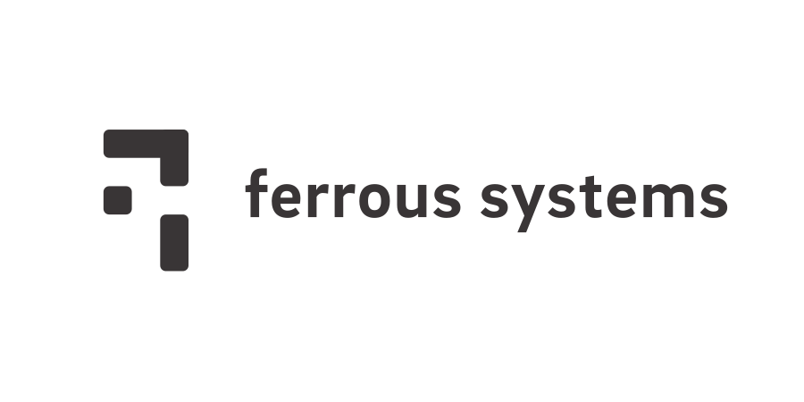
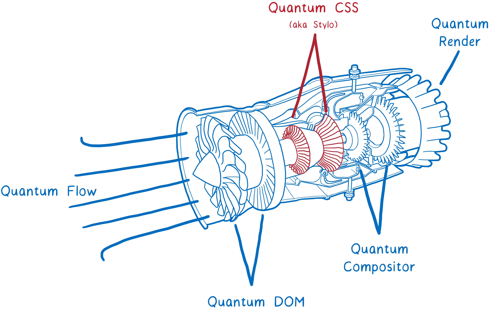
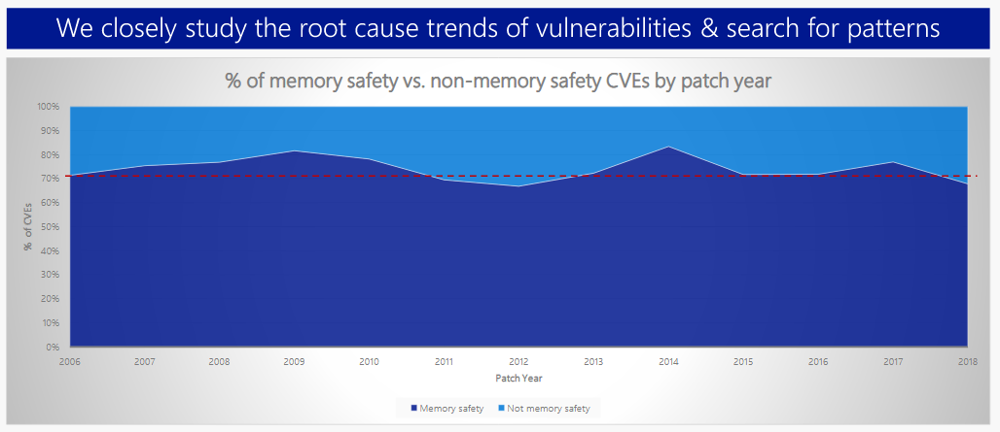
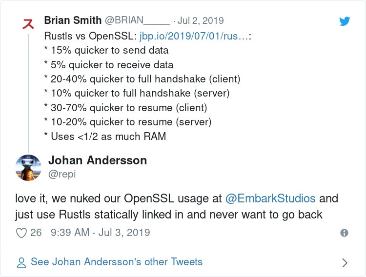
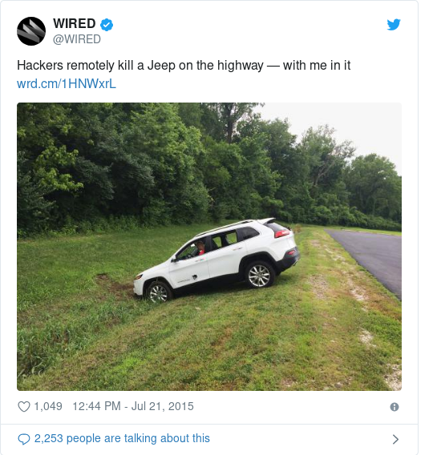

## Sealed Rust

Rust LDN

James Munns

2019-07-24

::: notes

:::

---

## I'm  James

@bitshiftmask

james.munns@ferrous-systems.com

---

---

## Safety Critical Software

* Avionics
* Gas Detection
* Robotics

---

## Other Kinds of "Critical" Software

---

## Security Critical

::: notes

* Web browsers
* Backend Services
* OpenSSL

* Loss of privacy
* Loss of User Data
* Circumvention of authentication

:::

---

## Mission/Business Critical

::: notes

* Trading software
* Infrastructure software

* Loss of primary function
* Loss of money
* Damage to projects/businesses

:::

---

## Safety Critical

::: notes

* Avionics
* Automotive
* Industrial

* Harm to the users
* Loss of human life

:::

---

## Failing Safe

::: notes

* All of these critical systems have an outcome they are trying to prevent
* We have to look at what happens when these systems fail
* How do they prevent losing the goal, even when things go wrong?

:::

---

## Rust is an excellent language for Critical Software

---

## Rust in Security Critical Software

---

## Mozilla - Firefox

---

---

## Microsoft

---

Image: Matt Miller

---

> We believe Rust changes the game when it comes to writing safe systems software. Rust provides the performance and control needed to write low-level systems, while empowering software developers to write robust, secure programs.
>
> *Ryan Levick, Principal Cloud Developer Advocate, Microsoft*

::: notes

Microsoft Security Response Center

:::

---

## Rustls

---

---

## Rust in Mission Critical Software

---

## NPM - Backend Services

---

> npm’s first Rust program hasn't
> caused any alerts in its year and a half
> in production. "My biggest compliment
> to Rust is that it's boring"
>
> *Chris Dickinson, NPM*

---

## Cloudflare - Wirefilter

---

> [W]e chose Rust as a safe high-level language that allows easy integration with other parts of our stack written in Go, C and Lua via C FFI.
>
> *Ingvar Stepanyan, Cloudflare*

::: notes

Used in Cloudflare Spectrum, used for mitigating DDoS of TCP traffic

:::

---

## Safety Critical is similar...

::: notes

These kinds of software have impact, we decide that they require additional rigor

:::

---

## ... But Safety Critical is different

::: notes

* Typically not pure-software projects
* Deals with human life, rather than business or data concerns
* Regulated Industry

:::

---

## Safety Critical Standards

::: notes

There are many industry specific standards for safety critical software

:::

---

## Systems Level Standards

::: notes

These standards cover the entire systems development lifecycle, including:

* Quality Process Management
* Requirement gathering
* Mechanical design
* Electrical design
* Software design

:::

---

## ... but we're talking about software

---

* DO-178C - Avionics
* IEC61508-3 - General Functional Safety
    * ISO26262-6 - Automotive
    * IEC62304 - Medical Software
    * ...

---

## Different People Wrote Each Standard

::: notes

So they all look a little different, and focus on domain-specific concerns

:::

---

## Similar Best Practices

---

## More lives at risk, more due dilligence

---

## Stuff like:

---

## Requirements

---

## Code Review

---

## Testing

---

## The point is to avoid errors

---

## Errors in design

---

## Errors in implementation

---

## Just don't make mistakes!

---

## Yeah, not good enough.

---

## This process generally works well...

---

## ... but can be very slow

---

## Lots of manual checking

::: notes

* intensive code review
* interpreting and maintaining static analysis
* application of coding standards

:::

---

## Lots of extra tooling required

::: notes

* External tools for things like MISRA checking
* Third party add-ons, little industry standardization

:::

---

## These safety nets are working!

---

## But Bugs are being found late

---

## And these systems are only getting more complex

---

## Systems are no longer...

---

## (safety XOR security XOR mission)

---

## ... critical

---

---

## And we have incompatible safety nets

---

## We have to move fast, AND get it right the first time

---

## It is no longer acceptable to consider mission, security, and safety critical systems in isolation

---

## Safety Critical can learn from other critical development areas

---

## Before I mentioned some sources of errors:

---

* Design Errors
* Implementation Errors

---

## Safety Critical also cares about errors caused by tools

---

## Tools like programming languages and compilers

---

## The real goal:

---

## Ensure that tools don't introduce problems

---

## We need confidence the tool will do what it is supposed to

---

## Nothing More

---

## Nothing Less

---

## How to build that confidence

---

## Sealed Rust

---

## Build Safety Critical Confidence in Rust

---

## Address regulatory hurdles necessary to bring Rust to new domains

---

## How?

---

## 1. Bring together the safety critical community

---

## 2. Develop a roadmap

---

## 3. Fund existing and new work

---

## 4. Make Rust the first compiler certified "in the open"

---

## What do we need?

---

## Drive Interest

---

## Find Funding

---

## Find Industry Leaders

---

## Raise the bar for responsible software engineering

---

## Help us make this a reality sooner than later

---

## Coordination repository

https://github.com/ferrous-systems/sealed-rust

---

## Newsletter

http://eepurl.com/guoC6P

---

## Thank you!

---

## Sealed Rust

Rust LDN

James Munns

2019-07-24
